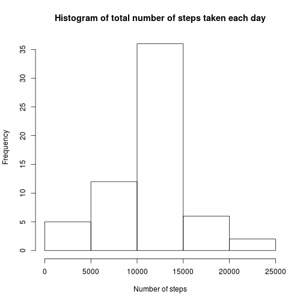
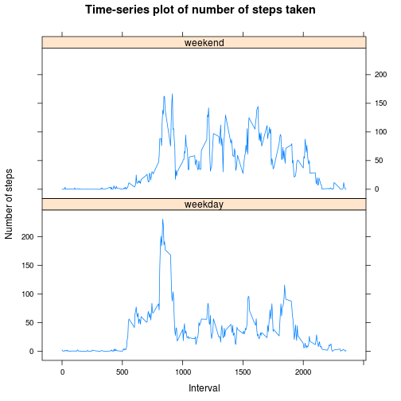

## Loading and preprocessing the data

```r
dat <- read.csv('activity.csv')
head(dat)
```

```
##   steps       date interval
## 1    NA 2012-10-01        0
## 2    NA 2012-10-01        5
## 3    NA 2012-10-01       10
## 4    NA 2012-10-01       15
## 5    NA 2012-10-01       20
## 6    NA 2012-10-01       25
```
The data in its current format is suitable for further analysis. Therefore, no further preprocessing of the data is required.  

## What is mean total number of steps taken per day?
First, we need to compute the total number of steps taken each day, ignoring the missing values, if any.

```r
# Subset the dataset to exclude the missing values
dat_sub <- dat[which(complete.cases(dat)),]
# Calculate the total number of steps taken per day for each day
num_steps <- tapply(dat_sub$steps, dat_sub$date,sum)
```
A histogram of the total number of steps taken per day can be plotted as follows:

```r
hist(num_steps,main = "Histogram of total number of steps taken each day", xlab = "Number of steps")
```

 

Thus, the mean total number of steps taken per day can be given by:

```r
mean(num_steps,na.rm=TRUE)
```

```
## [1] 10766.19
```
And the median can be given by:

```r
median(num_steps,na.rm=TRUE)
```

```
## [1] 10765
```
## What is the average daily activity pattern?
First, we need to compute the average number of steps taken in every 5-minute interval, averaged across all days. 

```r
# Compute the average number of steps taken in every 5-minute interval across all days.
num_steps <- tapply(dat_sub$steps, dat_sub$interval, mean)
```
Now, a time-series plot of the 5-minute interval and the average number of steps taken, averaged across all days, can be plotted as follows.

```r
plot(unique(dat_sub$interval),num_steps,type="l",xlab="Interval",ylab="Number of steps",main="Time-series plot of number of steps taken")
```

 

The interval that contains the maximum number of steps taken can be computed by:

```r
max_steps <- max(num_steps)
names(num_steps)[which(num_steps == max_steps)]
```

```
## [1] "835"
```
## Inputing missing values
First, we shall report the total number of missing values in the dataset.

```r
sum(!complete.cases(dat))
```

```
## [1] 2304
```
We shall fill the missing values by the mean for that particular 5-minute interval, which we have computed previously as `num_steps`.

```r
# Create a data frame with num_steps
numsteps <- data.frame(key = names(num_steps), value = num_steps)
dat_filled <- dat
# Replace missing values in the data with the mean for that particular 5-minute interval
for (i in which(is.na(dat_filled$steps))) {
  dat_filled$steps[i] <- numsteps$value[which(numsteps$key==dat_filled$interval[i])]
}
```
Now, we shall again compute the total number of steps taken each day.

```r
num_steps <- tapply(dat_filled$steps, dat_filled$date,sum)
```
A histogram of the total number of steps taken per day can be plotted as follows:

```r
hist(num_steps,main = "Histogram of total number of steps taken each day", xlab = "Number of steps")
```

 

Thus, the mean total number of steps taken per day can be given by:

```r
mean(num_steps,na.rm=TRUE)
```

```
## [1] 10766.19
```
And the median can be given by:

```r
median(num_steps,na.rm=TRUE)
```

```
## [1] 10766.19
```
As we can see, these values do not differ greatly from the estimates from the first part of the assignment. The impact of inputing missing data on the estimates of the total daily measures is not very prominent.  

## Are there differences in activity patterns between weekdays and weekends?
First, we shall Create a new factor variable in the dataset with two levels – “weekday” and “weekend” indicating whether a given date is a weekday or weekend day.

```r
dat_filled$date <- as.Date(dat_filled$date)
# Create a vector of weekdays
wdays <- c("Monday","Tuesday","Wednesday","Thursday","Friday")
dat_filled$weekday <- factor((weekdays(dat_filled$date) %in% wdays),levels = c("TRUE","FALSE"),labels = c("weekday","weekend"))
```
Now, we shall again compute the average number of steps taken in every 5-minute interval, averaged across all days. However, this time, we need to do it separately for weekdays and weekends separately.

```r
num_steps <- aggregate(steps~interval+weekday,data=dat_filled,mean)
numsteps <- data.frame(interval = num_steps[1],weekday = num_steps[2], value = num_steps[3])
```
Now, a time-series plot of the 5-minute interval and the average number of steps taken, averaged across all days, for weekdays and weekends separately, can be plotted as follows.

```r
library(lattice)
xyplot(steps~interval|weekday,dat=numsteps,type="l",xlab="Interval",ylab="Number of steps",main="Time-series plot of number of steps taken")
```

 
